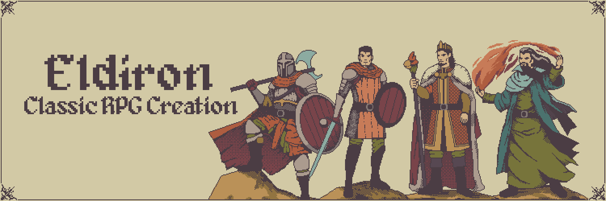

# Eldiron



Eldiron is an open-source RPG creator and runtime for building classic-style role-playing games.

Supported game styles:

- 2D tile RPGs
- Isometric RPGs
- First-person dungeon RPGs

## Build And Run

Prerequisites:

- Rust (stable): https://www.rust-lang.org/tools/install
- Linux packages: `libasound2-dev` `libatk1.0-dev` `libgtk-3-dev`

Run creator in dev mode:

```bash
git clone https://github.com/markusmoenig/Eldiron
cd Eldiron
cargo run -p eldiron-creator
```

Run release build:

```bash
cargo run --release -p eldiron-creator
```

## Workspace Overview

- `creator/`: desktop editor/creator application
- `clients/client/`: runtime client
- `crates/shared/`: shared game and data modules
- `crates/rusterix/`: game runtime + core rendering systems
- `crates/theframework/`: app and UI framework
- `crates/scenevm/`: layered rendering backend
- `docs/`: documentation website (Docusaurus)

## 2D RPG Foundation (Rust)

The shared crate includes reusable 2D RPG systems:

- `crates/shared/src/grid2d.rs`: typed 2D grid utilities
- `crates/shared/src/grid2d_time.rs`: 2D + time world storage
- `crates/shared/src/grid2d_history.rs`: delta history (undo/replay)
- `crates/shared/src/multidim.rs`: generic N-dimensional arrays
- `crates/shared/src/rpg2d.rs`: world, encounters, party, and battle logic

## Documentation

- Main docs: `docs/docs/`
- UML docs: `docs/docs/architecture/umls.md`

Run docs locally:

```bash
cd docs
npm install
npm run start
```

## License

MIT. See `License.txt`.
