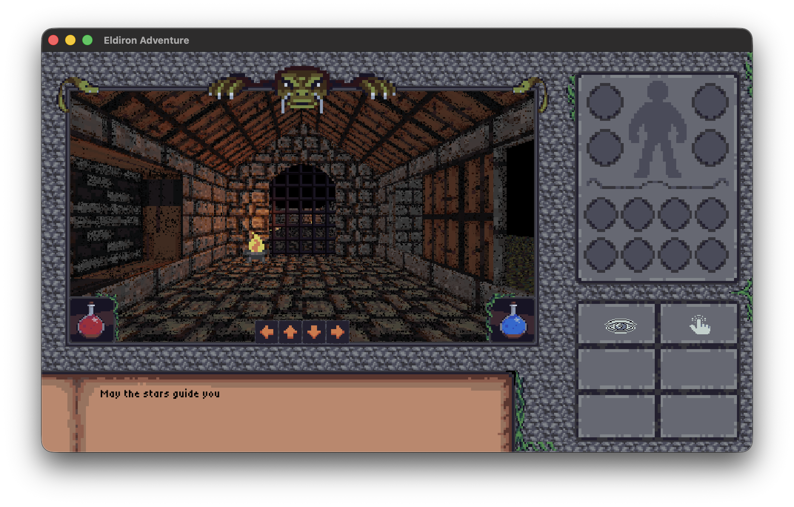

# NexusStudio Client

**NexusStudio Client** is the player client for games created with [NexusStudio](https://nexusstudio.com), an open-source creator for classic retro role-playing games (RPGs). NexusStudio enables the creation of RPGs reminiscent of the 1980s and 1990s while incorporating modern features such as multiplayer support, procedural content generation, and more.

NexusStudio natively supports **2D** (like Ultima 4/5), **isometric**, and **first-person** RPGs.



For more information visit [NexusStudio.com](https://nexusstudio.com) or the [GitHub repository](https://github.com/markusmoenig/NexusStudio).

```bash
cargo install nexusstudio-client
```

## License

Licensed under the MIT License.
