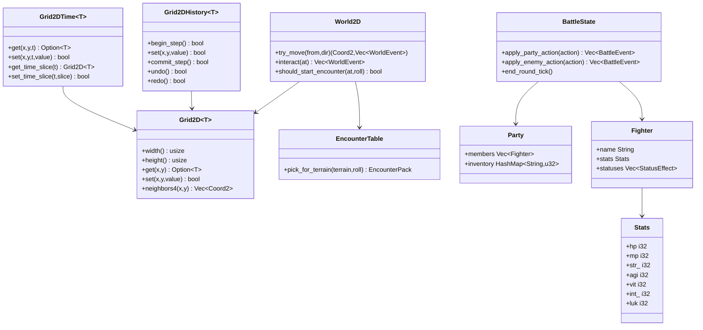
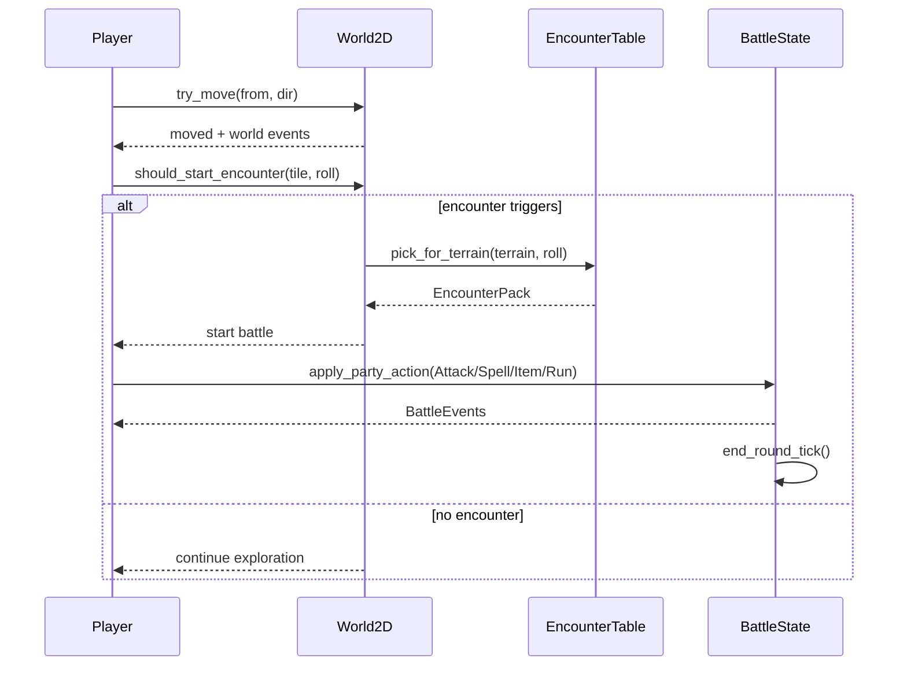
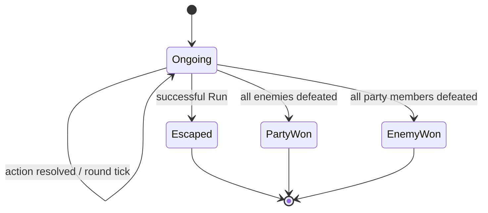

# NexusStudio UMLs

This page documents core system relationships and runtime flows.

## Class Diagram (Shared 2D RPG Core)

## Sequence Diagram (Movement -> Encounter -> Battle)

## State Diagram (Battle)

## Notes

- `Grid2DHistory` stores deltas, not full snapshots.
- `World2D` drives exploration and trigger execution.
- `BattleState` resolves turn actions and status effects.
- `EncounterTable` maps terrain to weighted monster packs.

